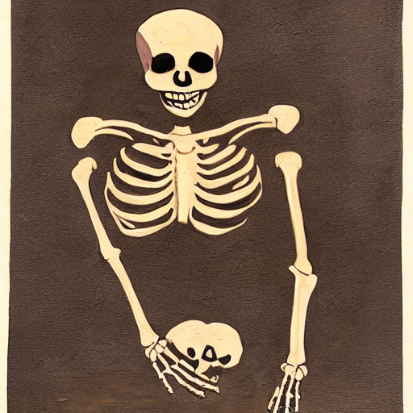
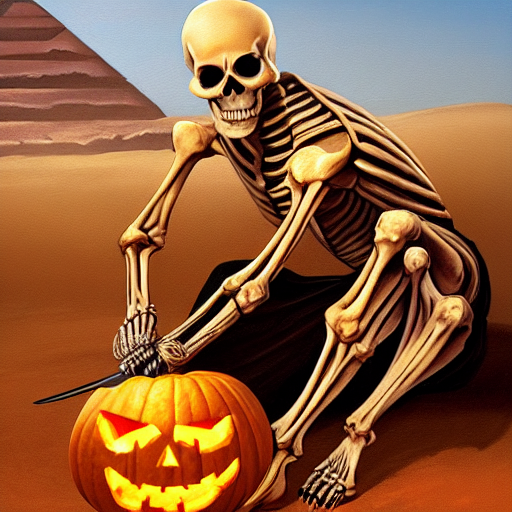
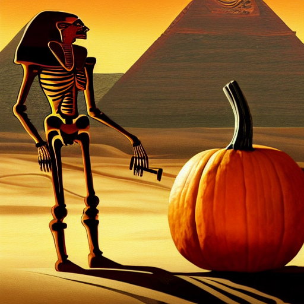
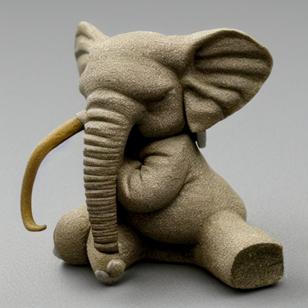
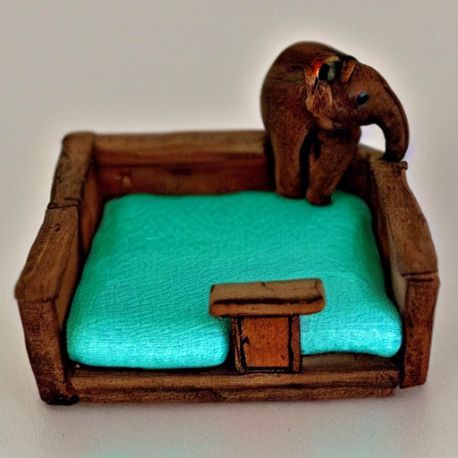
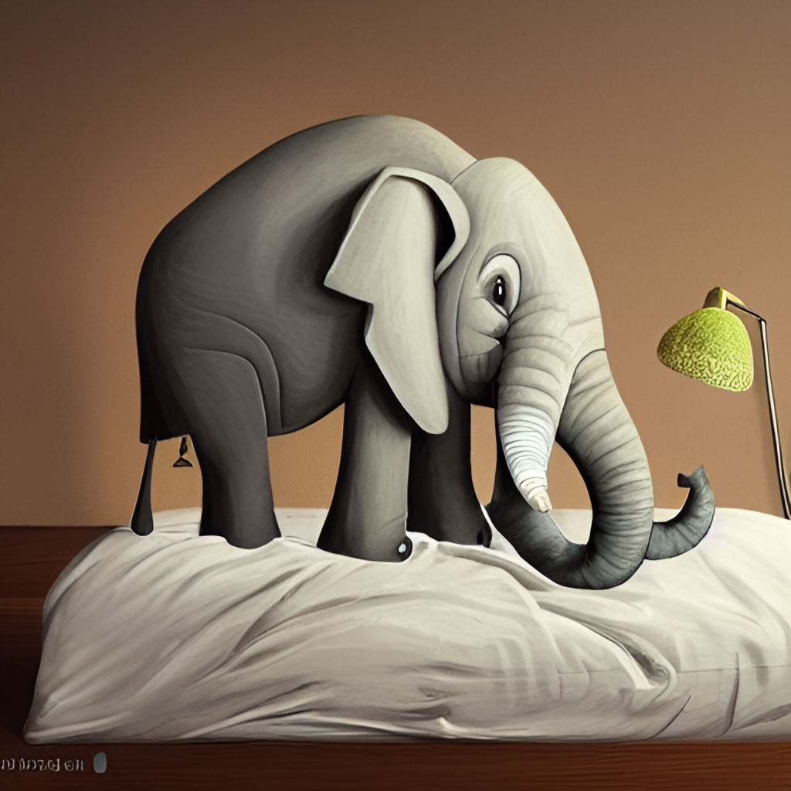
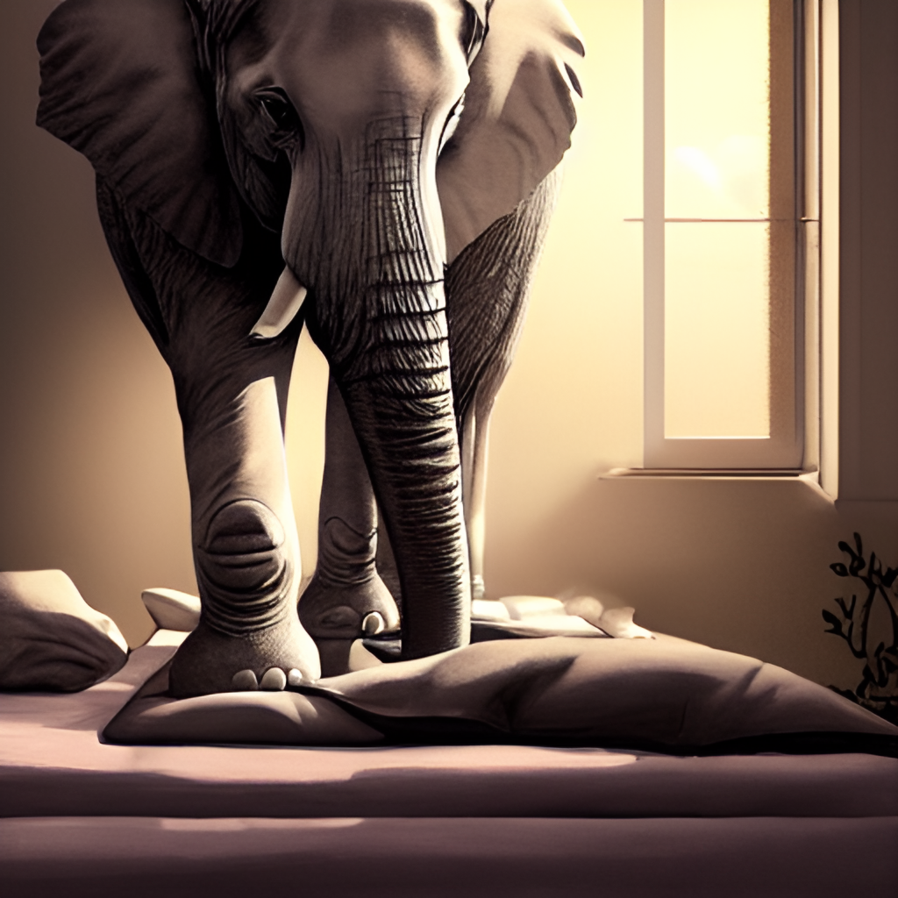

# Prompt Pre-processing for Stable Diffusion and other Text-to-Image Models

Writing prompts for text-to-image (T2I) models to produce the ideal image isn't an easy task. The optimal text prompts which best guide the models to generate images closer to the the desired result are often complex and require a lot of trial and error.

Various keywords/style modifiers are often required and have a significant effect on the quality of the generated image. Even subtle changes in the placement of words can drastically alter the output of an image (*unreal engine, artstation, 4k, 8k, hd, cinematic lighting, masterpiece*.)

## Initial experiments

Using a large language model (LLM) — OpenAI's `text-davinci-002` in my case — I was able to take real-world prompts written by people new to T2I models and expand them with more detail including realistic assumptions about what the desired image might look like.

With a little trial and error I put together several examples consisting of an original prompt and two versions rewritten to produce better images (including a list of style modifiers.)

By using this method to rewrite prompts in a live production environment, the model was able to generally produce subjectively better images when compared with outputs from the raw prompts.

### Examples

Note: these examples were manually chosen and will be biased towards better results.

**"painting of a skeleton carving a pumpkin in Ancient Egypt" (raw prompt)**

**"painting of a skeleton carving a pumpkin in Ancient Egypt" (processed prompt)**

 

**"a very tiny bed with a very detailed elephant standing on it" (raw prompt)**

 

**"a very tiny bed with a very detailed elephant standing on it" (processed prompt)**

 

## Fine-tuning an LLM to "un-simplify" text prompts

There are many [large sets](https://github.com/Jeremy-Fuller/Prompts/blob/main/prompts.txt) of curated, carefully-crafted T2I prompts that will produce more aesthetically pleasing (and subjectively accurate) images compared to a simplified/naive version of the same prompt.

By using an LLM to take a large curated set of prompts and simplify each one to only its core elements, we could easily create a dataset of naive/crafted prompt-pairs.

For example, the crafted prompt *"Keanu Reeves as spiderman, muscle extremely detailed, fantastic details full face, mouth, trending on artstation, pixiv, cgsociety, hyperdetailed Unreal Engine 4k 8k ultra HD, WLOP"* would be stripped down to the much more natural *"Keanu Reeves as Spiderman"*.

We could then fine-tune a language model to reverse this process (effectively "un-simplifying" prompts) and use this as a pre-processing step for a T2I model. 

By iterating/improving this model based on real world feedback, could we create a better text to image pipeline which more closely aligns the "language" of the image model with the intention of T2I prompt authors — including people already well-experienced with crafting prompts for T2I models?

Could the fine-tuned model even pick up on patterns (such as seemingly arbitrary ordering of modifiers) which produce more desirable results?
## Next steps

First I'd like to get community feedback and discuss the potential (and feasibility) of this idea. Is it worth pursuing this at all? Would the effort be better spent on improving the text-to-image models themselves?

### Tentative roadmap

- Create a dataset(s) of naive/crafted prompt-pairs from a large, curated set of text-to-image prompts
- Experiment with fine-tuning language models on the dataset(s) and evaluating the results on real-world prompts
- Explore the possibility of achieving similar results with smaller models which can run on consumer GPUs
- Open-source the models and datasets