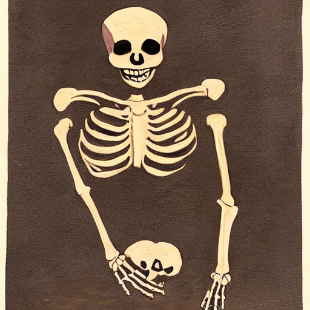
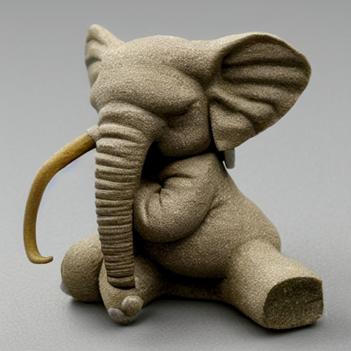
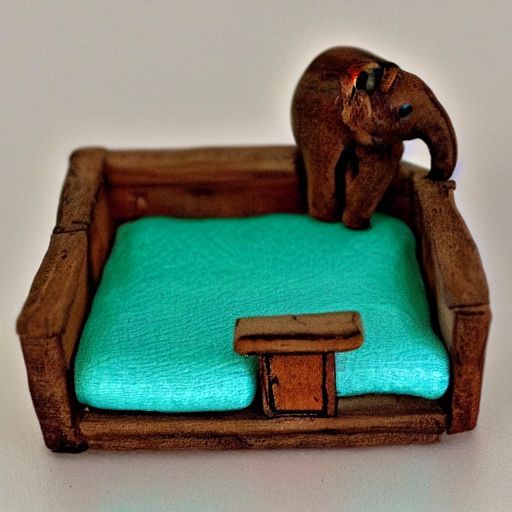

# Early experiments

Using a large language model (OpenAI's `text-davinci-002`) we were able to significantly improve prompts for [Stable Diffusion](https://github.com/CompVis/stable-diffusion) from people generally unfamiliar with TTI models.

Leveraging the LLM's natural language capabilities and knowledge of real-world concepts we were able to expand prompt descriptions into more explicitly detailed versions (based on common sense assumptions made by the language model), effectively filling in the gaps and emphasizing important aspects of the desired image in the prompt description.

Using this method in a live production environment, the model produced more aesthetically pleasing and prompt-aligned images when compared with outputs from original prompts. See below for select examples.

**"painting of a skeleton carving a pumpkin in Ancient Egypt" (raw prompt)**

**"painting of a skeleton carving a pumpkin in Ancient Egypt" (processed prompt)**

 

**"a very tiny bed with a very detailed elephant standing on it" (raw prompt)**

 

**"a very tiny bed with a very detailed elephant standing on it" (processed prompt)**

 